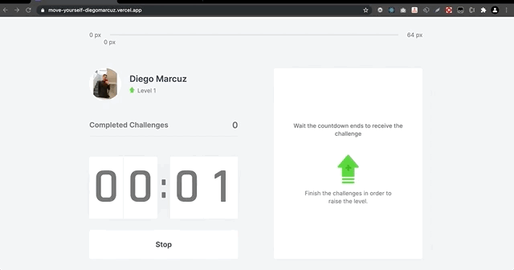

# moveIt

## Description 
Gamified Application which simulates the Pomodoro technique. Every time the countdown ends (it means you finished the 25 minutes of Pomodoro), a challenge will be shown on the right side of the screen. The purpose of these challenges is movement, makes you exercise yourself.

As right below it is demo, I set the countdown to 3 seconds, but the ideia is to set to 25 minutes.

## Preview 
- https://move-yourself-diegomarcuz.vercel.app/

## Technologies

- NextJS
- JS-Cookie (store the XP and Level of the player)
- CSS Modules
- Typescript
- ReactJS with ContextAPI
